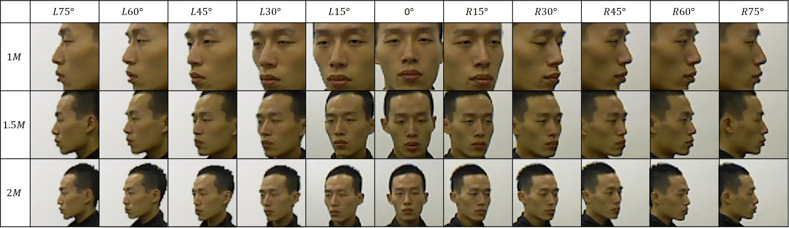

# RGB-D-Based Face Reconstruction and Recognition ([Website](https://sites.google.com/site/avlrgbdfacedatabase/))

Gee-Sern Jison Hsu , Yu-Lun Liu , Hsiao-Chia Peng , Po-Xun Wu

Most RGB-D-based research focuses on scene reconstruction, gesture analysis, and simultaneous localization and mapping, but only a few study its impacts on face recognition.We consider a similar scenario but with an RGB-D image pair taken at frontal pose for each subject in the gallery, only 2D images with a large scope of pose variations in the probe set, and study the advantage of the additional depth map on top of the regular RGB image.To study the performance variation of the proposed approach with RGB-D images taken at different distances, we built a new RGB-D face dataset on our own, called RGBDFaces.The RGBDFaces contains 28 subjects, 11 poses (L75°, L60°, L45°,..., R60°, R75°) and 5 distances (1m, 1.2m, 1.5m, 1.7m and 2m) between the Kinect sensor and the subject.

We hope that the RGB-D-Face database could revolutionized the landscape of face recognition research. A detailed introduction of RGB-D-Face can be found in the [paper](https://ieeexplore.ieee.org/abstract/document/6914582).

Here are some examples from the dataset.

<p align="center">
	
	<p align="center">
		<em>Samples in the RGBDFaces dataset</em>
	</p>
</p>


Update
--
|Date|Updata|
|----|------|
|2014-10-01|RGB-D-Face dataset is composed and made available to the research community.|


Data Download 
--
 1. [Get a password](#how-to-get-a-password)
 2. [Restriction](#restriction)
 3. [Download Link](#download-link)
 
How to get a Password
-
Please send an e-mail to the database administrator and cc. to Prof. Gee-Sern (Jison) Hsu to receive the passcode to unlock the zipped database. Your Email MUST be sent from a valid University account and include the following [request forms](./RequestForms.txt):

```
Subject: Application to download the RGB-D-Face database
Name: <your first and last name>
Affiliation: <University where you work>
Department: <your department>
Current position: <your job title>
Email: <must be the email at the above mentioned institution>
Postal Address:
Phone number:
I have read and agreed to follow the restrictions specified in the RGB-D-Face database webpage. This database will only be used for research purposes. I will not make any part of this database available to a third party. I'll not sell any part of this database or make any profit from its use.
<your signature>
```
In general, a password will take 3-7 workdays to issue. To avoid problems with our spam filter, make sure that your email is sent from an .edu (or similar) address. Failure to follow the instruction may result in no response. 

Database administrator: qunc85@gmail.com

Prof. Hsu's e-mail: jison@mail.ntust.edu.tw


Restriction
-
To guarantee the proper use of this database, the following restrictions must be followed by any person who has downloaded the database.
 1. All submissions, publications, and works that use or talk about the RGB-D-Face database must cite the paper. 
 2. Permission is NOT granted to reproduce or distribute the database. 
 3. Written permission must be approved by Prof. Gee-Sern Hsu if a faculty member desires to share the database with her/his co-workers or students. Even then, the database cannot be posted on a webpage accessible from outside the faculty research group. 
 4. No economical profit can be made from this database. 
 
No country or institution is excluded of any of the above restrictions. Failure to follow the restrictions will be legally prosecuted.

Download Link
-
[RGB-D-Face Download Link](http://140.118.199.217:5000/sharing/fbsharing-ffcN5TBJ)


Citation and Contact
--
If you like our work or find MLP dataset useful, please cite the following paper：
```
@article{hsu2014rgb,
  title={RGB-D-based face reconstruction and recognition},
  author={Hsu, Gee-Sern Jison and Liu, Yu-Lun and Peng, Hsiao-Chia and Wu, Po-Xun},
  journal={TIFS},
  year={2014},
}
```
Any suggestion or comment would be valuable. Please send an email to corresponding author (Gee-Sern Hsu) or Database administrator.
